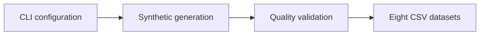

# AI Recruitment Dashboard — Synthetic Data Pipeline

[](https://github.com/Chanduuu21/AI-Recruitment-Dashboard/actions/workflows/ci.yml)

A reproducible Python pipeline that generates and validates synthetic recruitment data for analytics and Power BI practice.

> Academic project | M.S. Information Systems, Saint Louis University | 2025

## Why this project exists

Recruitment dashboards often combine candidates, jobs, applications, recruiters, skills, match scores, and platform telemetry. This project creates a realistic relational dataset for exploring that model without exposing applicant data or connecting to a live applicant-tracking system.

The repository demonstrates:

- Deterministic synthetic data generation with a configurable random seed
- Relational modeling across eight connected datasets
- Primary-key, foreign-key, null, uniqueness, and numeric-range validation
- Command-line configuration for dataset size, reference date, and output path
- Automated unit tests across Python 3.11 and 3.12
- Privacy-conscious analytics using synthetic records only

## Pipeline



## Data model

| Dataset | Grain | Key relationships |
|---|---|---|
| Candidates | One row per candidate | CandidateID |
| CandidateSkills | One row per candidate-skill pair | CandidateID → Candidates |
| Jobs | One row per job | JobID |
| JobSkills | One row per job-skill pair | JobID → Jobs |
| Applications | One row per application | CandidateID, JobID, RecruiterID |
| Matches | One row per candidate-job score | CandidateID, JobID |
| Users | One row per recruiter or system user | UserID |
| SystemMetrics | One row per recorded platform metric | MetricID |

## Quick start

### 1. Create an environment

```bash
python -m venv .venv
source .venv/bin/activate
```

On Windows, activate with `.venv\Scripts\activate`.

### 2. Install dependencies

```bash
pip install -r requirements.txt
```

### 3. Generate the default datasets

```bash
python data_generation.py
```

CSV files are written to the `data/` directory.

### 4. Customize the run

```bash
python data_generation.py \
  --output-dir data/demo \
  --seed 101 \
  --candidates 500 \
  --jobs 75 \
  --applications 1500 \
  --matches 400 \
  --as-of-date 2025-12-01
```

View all options with `python data_generation.py --help`.

## Validation controls

The pipeline fails before writing data when it detects:

- Missing required datasets
- Null or duplicate primary keys
- Orphaned candidate, job, or recruiter references
- Resume, similarity, or experience values outside accepted ranges
- Non-positive dataset-size configuration

## Run the test suite

```bash
python -m unittest discover -s tests -v
```

GitHub Actions runs the same tests for every push and pull request to `main`.

## Power BI use

1. Generate the CSV files.
2. Import the eight files from the output directory.
3. Create one-to-many relationships from Candidates, Jobs, and Users to the related fact and bridge tables.
4. Build measures for application funnel conversion, time trends, recruiter workload, candidate experience, skill coverage, match-score distribution, and platform performance.
5. Document that every record and score is synthetic.

## Repository structure

```text
AI-Recruitment-Dashboard/
├── .github/workflows/ci.yml
├── data/.gitkeep
├── tests/test_data_generation.py
├── data_generation.py
├── requirements.txt
└── README.md
```

## Responsible use

This project does not train a hiring model and does not recommend real candidates. Similarity scores are synthetic values created for dashboard development. Real hiring systems require validated job-related criteria, bias testing, human oversight, privacy controls, explainability, and legal review.

## Author

**Chandrasai Ettneni** — Data Engineer

- [Professional portfolio](https://chanduuu21.github.io/)
- [LinkedIn](https://www.linkedin.com/in/chandrasai-ettneni/)
- [GitHub profile](https://github.com/Chanduuu21)
